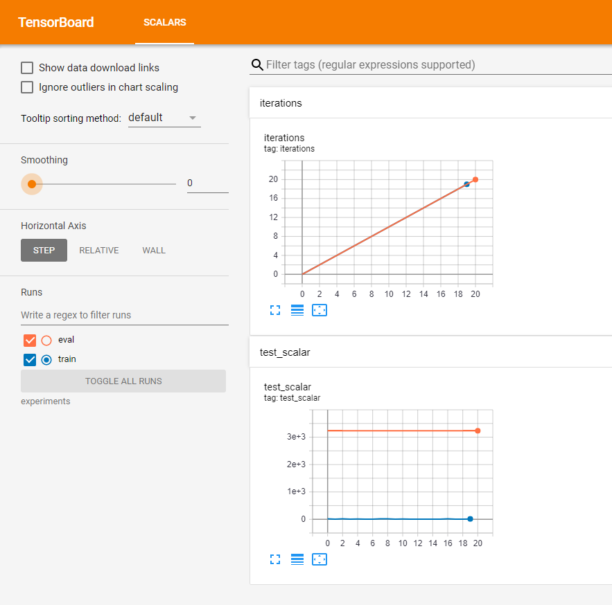
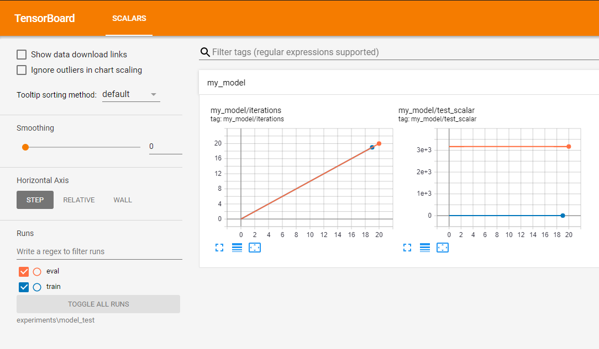

# Keras Tensorboard Starter

This is a keras starter project that provides tf.summary logging out of the box 
inside your model inference code for both train and eval runs.

You should be able to see something like

where 
- eval has exactly 3 records (at 0, 10 and 20 corresponding to 3 `evaluate`s)
- train has 20 records (0-9 and 10-19 corresponding to 2 `fit`s with 10 epochs each)
 
## Instructions
 
From Tensorflow 2.2, we can override Keras `model.fit` using `Model.train_step`. 
This allows us to write a custom train step and use the same old `model.fit` in an elegant way, 
but to call our custom train step logic. See example at [train_and_evaluate.py](train_and_evaluate.py)

## For Older Versions

For older versions of tensorflow, the hack implemented in [train_and_evaluate_old.py](train_and_evaluate_old.py) 
where we can pass the summary writer into an argument
and use it in `call` method to log can be a workaround.

Although it's not as elegant as the above method, it works!

